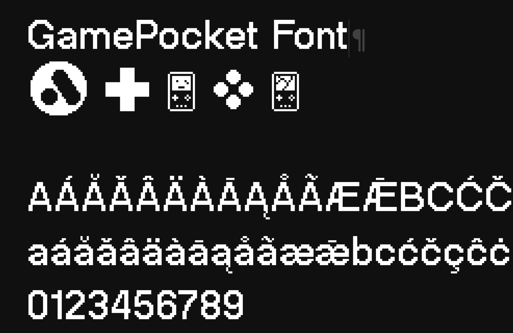

# GamePocket Font



## About

This repo contains an open-source font that is a recreation of the font used in Analogue OS on the Analogue Pocket Device. To avoid obvious trademark copyright issues, I changed the name of the original font family to "GamePocket".

The project is heavily based on [AbFarid's work](https://github.com/AbFarid/analogue-os-font), Salute!

And the original font was designed by [Analogue Inc.](https://www.analogue.co/), and I do not claim any ownership of it. This is simply a recreation for personal use. The repository has been created as a way to share my recreation of the font with the public.

Feel free to use this font in any way you see fit. If you do use it, I would appreciate a credit in the form of a link to this repository.

## Progress

v1.005:
- Almost all glyphs in Analogue Pocket. (Firmware v1.1 beta7)
- Most of the Latin glyphs for European languages.
- Deep deep kerning.
- Plus some suprise:)

### Full kerning / Zero kerning
Analogue Pocket's handling of font kerning is not uniform across menus/content. What is clear is that there are designers who manually adjust the spacing (or kerning) in the menu layout.

But again, all kerning data was dropped in the EULA and other content, making readability worse.

So in this project, kerning is handled in two ways：

- `GamePocket-Regular` version: Using the AI technology of commercial software "Kern On", we kerned the font completely, about 4000 pairs, increasing the file size by 16kb. Since Kern On does not follow the "pixel design principle", the Kerning Trim script in Glyphs3 was used to organize the kerning to ensure that each set of kerning is quantified "by pixel width".

  This version has been optimized to be very readable. It is also the version used in the demo site for this project.

- `GamePocket-Regular-ZeroKern` version: No kerning is done at all. Referring to traditional console logic, the original design spacing of the glyphs is always maintained. Although clumsy, it is full of ambience. Worth trying.

## Live demo
See a recreation of Analogue Pocket's home screen using HTML and CSS [here](https://mumchristmas.github.io/GamePocket-font/).

## Download

`.ttf`, and `woff/2` files can be downloaded from the [`/dist`](https://github.com/mumchristmas/GamePocket-font/tree/master/dist) folder or from the [Releases](https://github.com/mumchristmas/GamePocket-font/releases/) page.

## Source

Files included in the [`/src`](https://github.com/mumchristmas/GamePocket-font/tree/master/src) folder:
- `.glyphspackage` (Glyphs3) project file
- `.ufo` UFO file

AbFarid's original project used FontLab8 as the font editor. In this project, I migrated the .ufo file to Glyphs3 for easier work. Although it is commercial software, Glyphs V3 format opens up the [development documentation](https://github.com/schriftgestalt/GlyphsSDK/blob/Glyphs3/GlyphsFileFormat/GlyphsFileFormatv3.md) and can work better with open-source font tool projects such as [fonttools](https://github.com/fonttools/fonttools).

## How to use

### In word processors
Download the `.ttf` file and install it.

### In web pages
1. Download the `.woff` and `.woff2` files and copy them to your project.
2. Add the following CSS, but replace the font path with your own:
```css
@font-face {
  font-family: 'GamePocket';
  src: url('assets/GamePocket-Regular.woff2') format('woff2'),
       url('assets/GamePocket-Regular.woff') format('woff');
  font-weight: normal;
  font-style: normal;
}
```
3. Use like any other font: `font-family: GamePocket, sans-serif;`
